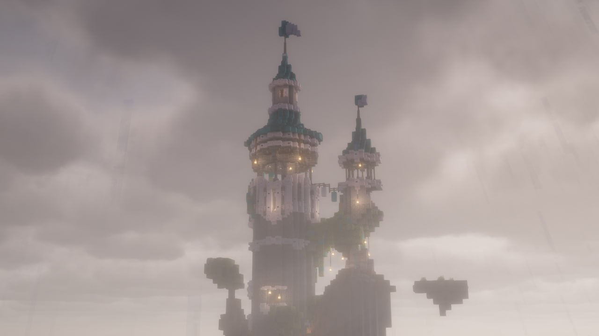
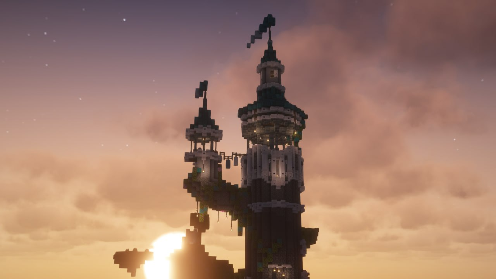
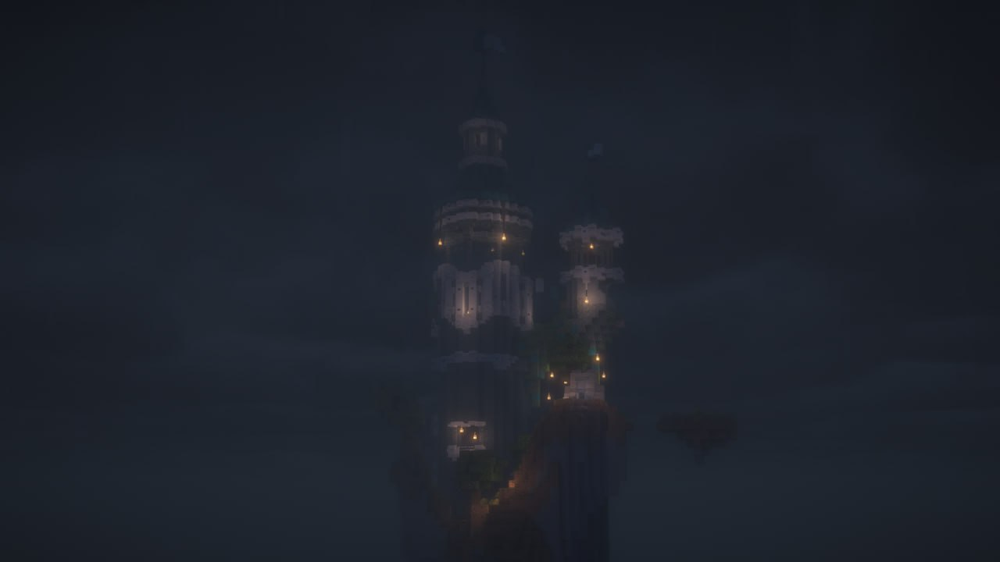
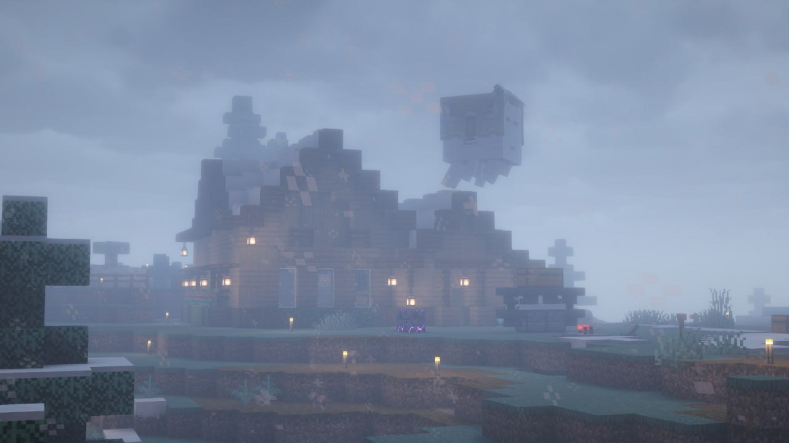
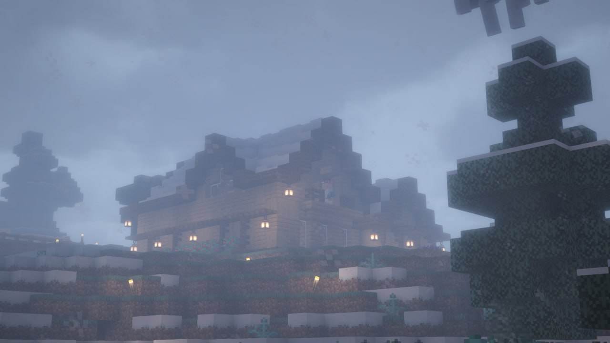
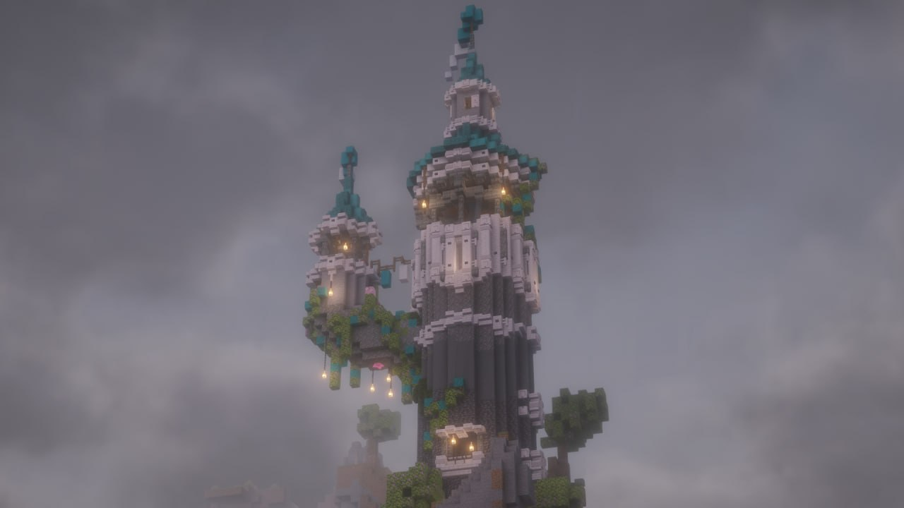
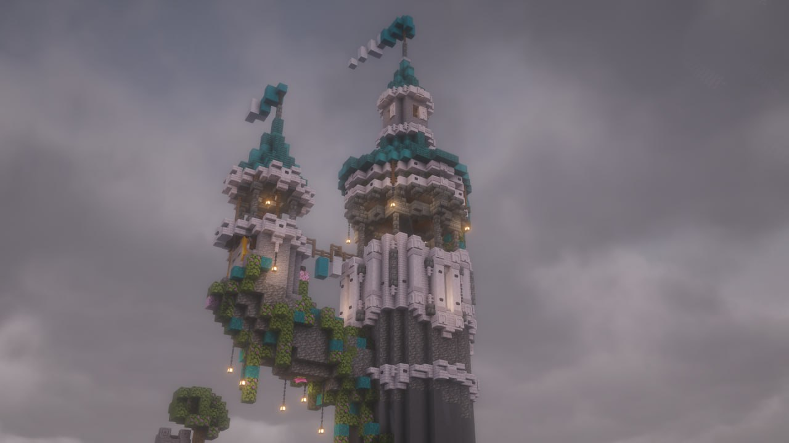
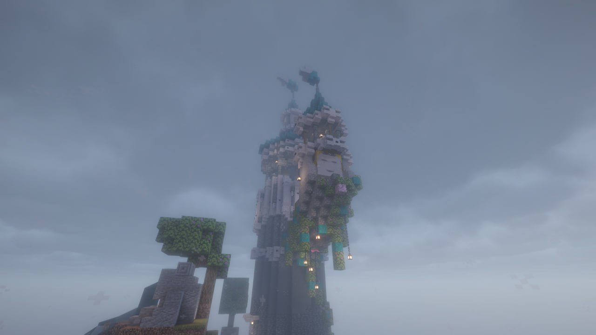
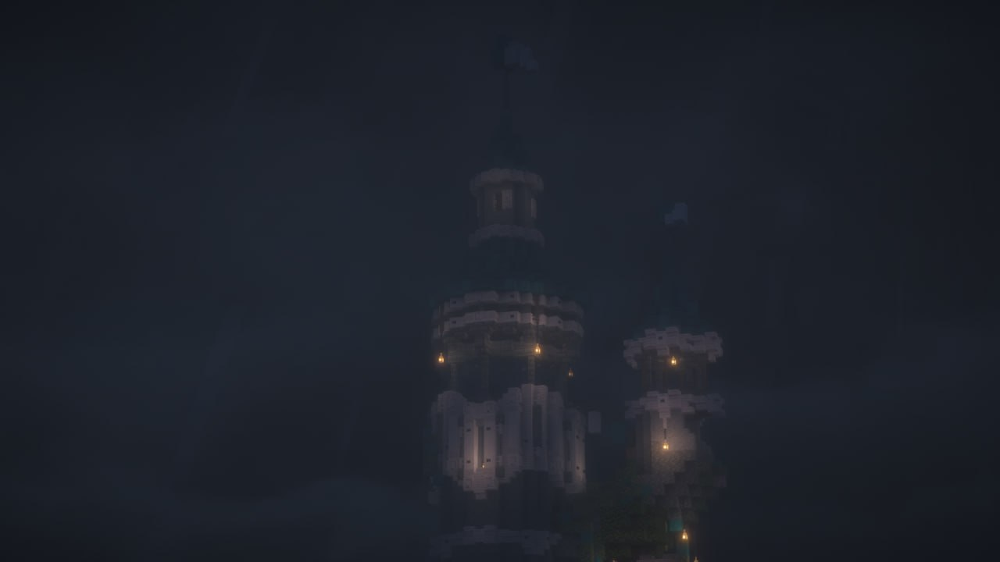
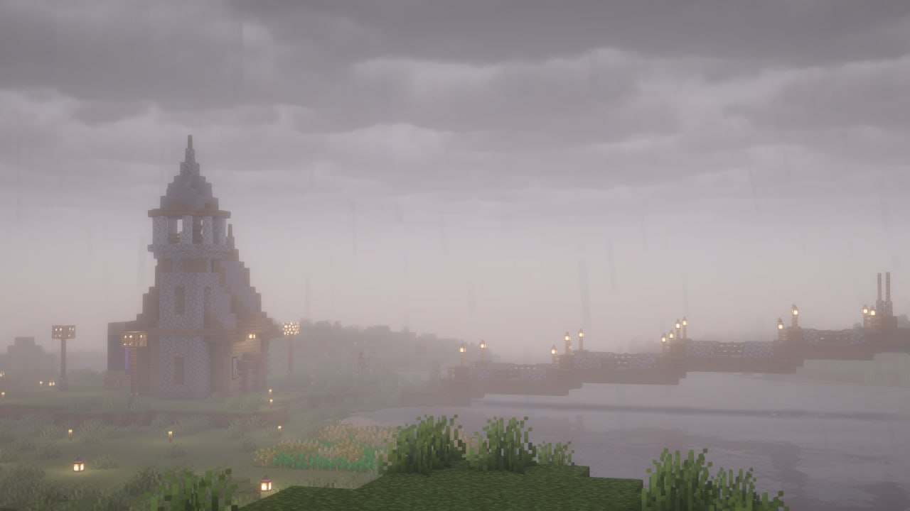

<html lang="ru">
<head>
  <meta charset="utf-8"/>
  <meta name="viewport" content="width=device-width,initial-scale=1"/>
  <title>ALTARIS — Мир без вайпов</title>
  <link rel="icon" type="image/png" href="favicon.png">

<link rel="preconnect" href="https://fonts.googleapis.com">
<link rel="preconnect" href="https://fonts.gstatic.com" crossorigin>
<link href="https://fonts.googleapis.com/css2?family=Inter:wght@400;600;700;800&display=swap" rel="stylesheet">

</head>

<body>

<!-- HEADER -->
<header class="max-w-6xl mx-auto p-4 flex justify-between items-center border-b-4 border-black">
  

    
A

    

      
altaris

      
мир без вайпов

    

  

 <!-- ИКОНКИ САЙТА -->
  <link rel="apple-touch-icon" sizes="57x57" href="/apple-icon-57x57.png">
  <link rel="apple-touch-icon" sizes="60x60" href="/apple-icon-60x60.png">
  <link rel="apple-touch-icon" sizes="72x72" href="/apple-icon-72x72.png">
  <link rel="apple-touch-icon" sizes="76x76" href="/apple-icon-76x76.png">
  <link rel="apple-touch-icon" sizes="114x114" href="/apple-icon-114x114.png">
  <link rel="apple-touch-icon" sizes="120x120" href="/apple-icon-120x120.png">
  <link rel="apple-touch-icon" sizes="144x144" href="/apple-icon-144x144.png">
  <link rel="apple-touch-icon" sizes="152x152" href="/apple-icon-152x152.png">
  <link rel="apple-touch-icon" sizes="180x180" href="/apple-icon-180x180.png">

  <link rel="icon" type="image/png" sizes="192x192" href="/android-icon-192x192.png">
  <link rel="icon" type="image/png" sizes="32x32" href="/favicon-32x32.png">
  <link rel="icon" type="image/png" sizes="96x96" href="/favicon-96x96.png">
  <link rel="icon" type="image/png" sizes="16x16" href="/favicon-16x16.png">

  <link rel="manifest" href="/manifest.json">

  <meta name="msapplication-TileColor" content="#ffffff">
  <meta name="msapplication-TileImage" content="/ms-icon-144x144.png">
  <meta name="theme-color" content="#ffffff">
  

    <a href="https://discord.gg/6WDeeJnT" target="_blank"
      class="bg-[var(--accent)] text-black font-bold px-4 py-2 rounded-full border-2 border-black shadow-pop press">
      Discord
    </a>
    <a href="https://t.me/altaris_whitellist" target="_blank"
      class="border-2 border-black rounded-full px-4 py-2 shadow-pop press">
      Заявка
    </a>
  

</header>

<!-- HERO -->
<section class="max-w-6xl mx-auto p-6 mt-6 bg-[var(--surface)] border-2 border-black rounded-2xl shadow-pop">
  <h1 class="text-4xl font-extrabold mb-3">ALTARIS</h1>
  

    Minecraft-сервер формата полуваниллы для тех, кто хочет играть в одном мире долго.
    Без вайпов. Без обнулений. Со своей историей.
  

  

    Каждый дом, дорога и город остаются частью мира навсегда.
  

  

    <a href="https://discord.gg/6WDeeJnT" target="_blank"
      class="bg-[var(--accent)] text-black font-bold px-6 py-3 rounded-full border-2 border-black shadow-pop press">
      Зайти на сервер
    </a>
    <a href="https://t.me/altaris_server" target="_blank"
      class="border-2 border-black rounded-full px-6 py-3 shadow-pop press">
      Новости проекта
    </a>
  

</section>

<!-- ABOUT -->
<section class="max-w-6xl mx-auto p-6">
  <h2 class="text-2xl font-bold mb-4">О сервере</h2>
  

    

      ALTARIS — это живой мир Minecraft, который развивается вместе с игроками.
      Здесь нет вайпов, поэтому всё, что вы строите, имеет смысл и остаётся частью истории.
    

    

      Сервер создан для спокойной, долгой игры: масштабные проекты, города, дороги,
      совместные инициативы и события.
    

    

      Мир не гонится за скоростью. Он растёт постепенно, аккуратно и естественно.
    

  

</section>

<!-- FEATURES -->
<section class="max-w-6xl mx-auto p-6">
  <h2 class="text-2xl font-bold mb-4">Плюшки сервера</h2>

  

    

      <h3 class="font-bold">Жители 2.0</h3>
      

        Улучшенная торговля, оптимизация и более прокаченные жители.
      

    

    

      <h3 class="font-bold">Уникальный сид</h3>
      

        Горы с сакурой, реки, моря и просторные поля вокруг.
      

    

    

      <h3 class="font-bold">1000 достижений</h3>
      

        Большой датапак с дополнительными целями и испытаниями.
      

    

    

      <h3 class="font-bold">Уникальный лор</h3>
      

        История мира начнёт раскрываться в ближайшие дни.
      

    

  

</section>

<!-- NEWS -->
<section class="max-w-6xl mx-auto p-6">
  <h2 class="text-2xl font-bold mb-4">Лента новостей</h2>

  

    

      
15.12.2025 — Открытие сервера

      

        ALTARIS успешно открылся. Онлайн на старте — 12 игроков.
      

    

    

      
20.12.2025 — Яйцо дракона

      

        На открытии Энда яйцо дракона забрал игрок <b>kostyan4ik</b>.
      

    

    

      
Тайный Санта

      

        Старт доброго и таинственного ивента. Каждый — чей-то волшебник в тени.
      

    

  

</section>

<!-- GALLERY — ЗАМЕНИТЕ СТАРЫЙ БЛОК НА ЭТОТ -->
<section id="gallery" class="max-w-6xl mx-auto p-6">
  <h2 class="text-2xl font-bold mb-4">Скриншоты мира</h2>

  

    <!-- 12 SCREENSHOTS: images/0.jpg .. images/11.jpg -->
    

      
    

    

      
    

    

      
    

    

      
    

    

      
    

    

      
    

    

      
    

    

      
    

    

      
    

    

      
    

    

      
    

    

      
    

  

  <!-- Lightbox (один общий элемент) -->
  

    

    

      <button onclick="closeLightbox()" class="absolute right-4 top-4 bg-[var(--surface)] border-2 border-black rounded-full p-2 shadow-pop">✕</button>
      
    

  

</section>

<!-- RULES (ACCORDION) — ЗАМЕНИТЕ СТАРЫЙ БЛОК НА ЭТОТ -->
<section id="rules" class="max-w-6xl mx-auto p-6">
  <h2 class="text-2xl font-bold mb-4">Правила сервера</h2>

  

    
1. ОСНОВЫ ВЗАИМОУВАЖЕНИЯ

    

      
Наш сервер — это комфортное пространство для всех игроков.

      
<strong>Обязанности каждого:</strong>

      <ul class="list-disc ml-5 mt-2">
        <li>Быть вежливым и доброжелательным.</li>
        <li>Уважать других игроков, их мнение, стиль игры и личные границы.</li>
        <li>Помнить, что за каждым ником — живой человек.</li>
      </ul>

      
<strong>Строго запрещено:</strong>

      <ul class="list-disc ml-5 mt-2">
        <li>Оскорбления, унижения, травля (буллинг).</li>
        <li>Расизм, сексизм и любая дискриминация.</li>
        <li>Провокации конфликтов и намеренное разжигание ссор.</li>
      </ul>

      
<strong>Также запрещено:</strong> реклама других серверов и проектов без разрешения; PvP без явного и обоюдного согласия.

      
<strong>Наказание (PvP без согласия):</strong> первое — бан 1 день; повторное — срок увеличивается ×2.

    

  

  

    
2. ЧЕСТНАЯ ИГРА (АНТИЧИТ)

    

      
Сервер придерживается принципа честной игры. Любые читерские преимущества разрушают экономику и атмосферу.

      
<strong>Разрешено:</strong> OptiFine, Sodium, Lithium, мини-карта (без X-Ray), Replay Mod, настройки яркости.

      
<strong>Запрещено:</strong> Wurst, Aristois, Baritone, X-Ray (моды и текстуры), авто-кликеры и макросы для PvP, создание лаг-машин и дюп-ферм, DDoS/умышленный вред сервера.

      
<strong>Наказание:</strong> за читы и дюпы — бан на 1 месяц без предупреждений; за лаг-машины/вред серверу — первое нарушение 7 дней, повторное или умышленное вредительство — перманентный бан.

    

  

  

    
3. ГРИФЕРСТВО И ВОРОВСТВО

    

      
Сервер построен на доверии, но злоупотребления не допускаются.

      
<strong>Запрещено:</strong> ломать, портить или изменять чужие постройки без разрешения владельца; воровать из сундуков, печей и хранилищ; использовать чужие фермы без согласия.

      
<strong>Наказание:</strong> первое нарушение — бан 3 дня; повторное — 7 дней; систематическое — по решению администрации.

    

  

  

    
4. ОБЩЕНИЕ В ЧАТЕ

    

      
Чат — для общения, а не хаоса.

      
<strong>Запрещено:</strong> спам, флуд, бессмысленные сообщения, постоянный CAPS LOCK, политические и религиозные холивары.

      
<strong>Наказание:</strong> мут от 1 часа; повторное нарушение — мут ×2.

    

  

  

    
5. ПОСТРОЙКИ И ЛАНДШАФТ

    

      
Мир сервера — общий. Уважайте внешний вид ландшафта и соседей.

      
<strong>Запрещено:</strong> гигантские столбы из грязи, «летающие» деревья, открытая лава, постройки с оскорбительным или непристойным содержимым.

      
Оптимизируйте фермы и механизмы, чтобы не создавать лагов. Не стройте ближе <strong>200 блоков</strong> к чужим базам без договорённости.

      
<strong>Наказание:</strong> предупреждение → бан от 1 дня; повторное — ×2.

    

  

  

    
6. АДМИНИСТРАЦИЯ И МОДЕРАЦИЯ

    

      
Администрация и модерация — для помощи и порядка.

      
Не спорьте с модераторами в публичном чате, все жалобы и вопросы оформляйте в тикетах или в личных сообщениях.

      
<strong>Запрещено:</strong> выдавать себя за администрацию; требовать предметы, права или телепортацию у модеров.

      
<strong>Наказание:</strong> мут или бан от 6 часов; повторное нарушение — ×2.

      
<strong>Актуальная администрация:</strong>

      <ul class="list-disc ml-5 mt-1 text-sm">
        <li>Тех. админ: Тёма Тема</li>
        <li>Администраторы: Тёма Тема, gyrt46, Василёк, имп хй</li>
      </ul>
    

  

  

    
7. БЕЗОПАСНОСТЬ И ВОЗРАСТ

    

      
Контент 18+ (постройки, текст, названия) — запрещён. Рекомендуемый возраст игроков — 16+.

      
Решает адекватность, а не лишь цифра в паспорте.

      
<strong>Наказание:</strong> бан от 7 дней; повторное — перманентный бан.

    

  

  

    
8. СИСТЕМА НАКАЗАНИЙ

    

      
Общая схема: <strong>Предупреждение → Мут → Временный бан → Вечный бан</strong>. История наказаний хранится и учитывается при решениях.

      
За читы, дюпы и откровенное гриферство — вечный бан без предупреждения.

    

  

  

    
9. ГЛАВНЫЙ ПРИНЦИП

    

      
Относитесь к другим так, как хотите, чтобы относились к вам.

      
Игрок, который знает правила и помогает их соблюдать — ценнейший участник сообщества.

    

  

</section>

<!-- FOOTER -->
<footer class="border-t-4 border-black mt-10 p-6">
  

    <a href="https://discord.gg/6WDeeJnT" target="_blank"
      class="bg-[var(--accent)] text-black font-bold px-6 py-3 rounded-full border-2 border-black shadow-pop press">
      Discord
    </a>
    <a href="https://tiktok.com/@altaris_server" target="_blank"
      class="border-2 border-black rounded-full px-6 py-3 shadow-pop press">
      TikTok
    </a>
    <a href="https://t.me/altaris_server" target="_blank"
      class="border-2 border-black rounded-full px-6 py-3 shadow-pop press">
      Telegram
    </a>
    <a href="https://t.me/altaris_whitellist" target="_blank"
      class="border-2 border-black rounded-full px-6 py-3 shadow-pop press">
      Заявка
    </a>
  

</footer>

</body>
</html>
